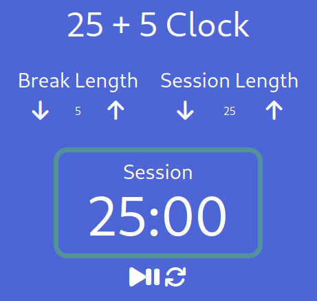

# **Pomodoro (25+5) Clock**

> App to apply the Pomodoro Technique to your daily tasks

Available live [here](https://fernet87.github.io/25-5-clock/) 

## About the Project



This is a React based app to Build the 25 + 5 Clock for [freeCodeCamp](https://www.freecodecamp.org/learn/front-end-libraries/front-end-libraries-projects/build-a-25--5-clock) Front End Development Libraries project.
In this clock you can specify a break and a session time.
After doing that you can start and stop the clock and reset the timer to the default values.

## **Technologies used for this project.**

[](https://html.spec.whatwg.org/multipage/) [](https://www.css3.com/) [](https://developer.mozilla.org/en-US/docs/Web/JavaScript)
[](https://reactjs.org/) [](https://redux.js.org/) [](https://sass-lang.com/)

### **How to start project**

Install project dependecies:

```
npm install
```

Start the web server

```
npm start
```

---
Read more about [pomodoro (25+5) clock](https://en.wikipedia.org/wiki/Pomodoro_Technique)
